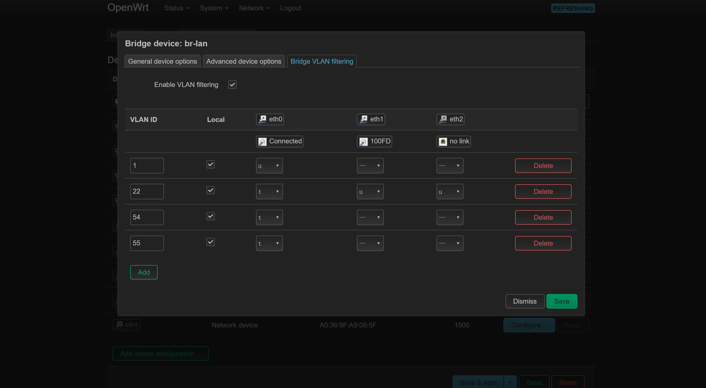
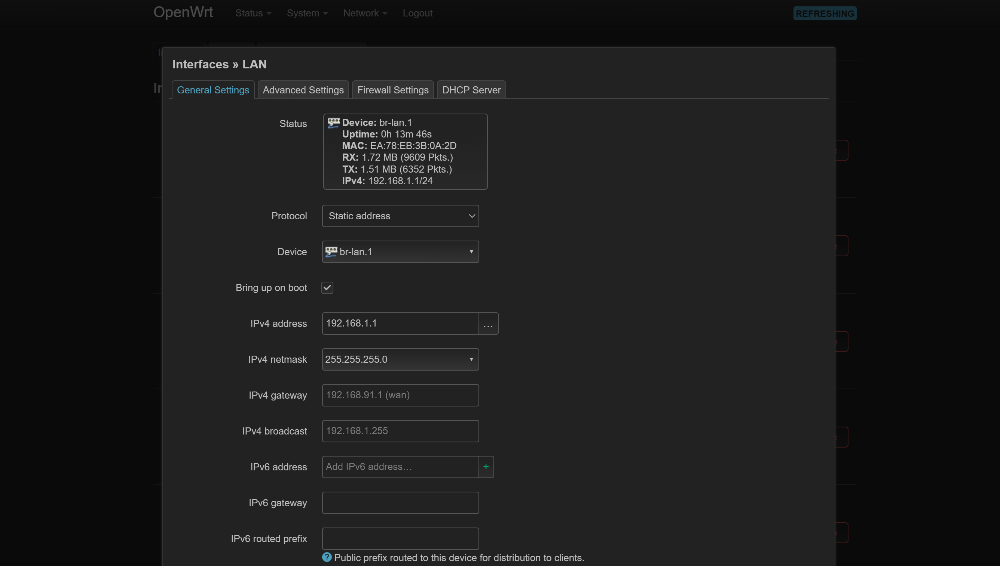
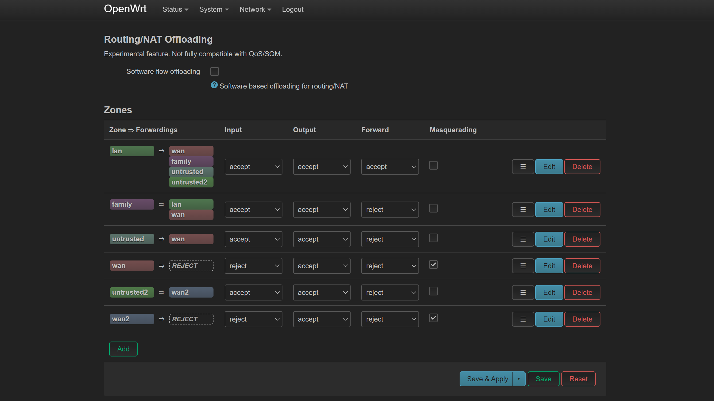

# OpenWRT安装
## 下载镜像
[openwrt](https://downloads.openwrt.org/releases/21.02.3/targets/x86/64/)
下载`x86-64-generic-ext4-combined-efi`镜像

## 安装
注意不需要磁盘，且添加直通网卡时最好按照顺序添加，启动前修改`/etc/pve/qemu-server/{VM_ID}.conf`，将镜像转化为磁盘：
```
ide2: local:iso/openwrt-21.02.3-x86-64-generic-ext4-combined-efi.img,cache=unsafe
```

## VLAN配置
在`Network->Interfaces->br-lan->Configuration->Bridge VLAN filtering`下勾选`Enable VLAN filtering`并配置VLAN标记，点`Save`后先**不要**点`Save & Apply`生效，修改`Network->Interfaces->lan->Global Settings->Device`为管理VLAN，然后点`Save & Apply`，**否则将无法连接Openwrt管理页面**。



## firewall配置
